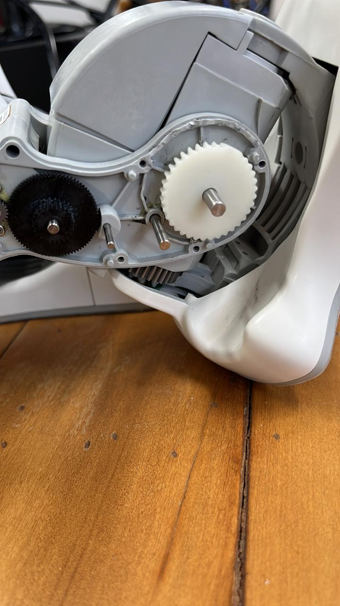

# NAO V5 Robot Ankle Gear Replacement

This repository contains the replacement 3D model (STL/STEP) for the ankle joint gear of the **SoftBank Robotics NAO V5** humanoid robot. 

## The Chronic Issue
The ankle gear in the NAO V5 model is a notorious and chronic failure point. Due to the high torque requirements during walking, stabilization, and dynamic movements, the original injection-molded plastic gear frequently strips or cracks over time. This repository aims to provide an exact open-source replacement to keep your NAO robot operational without requiring expensive official repair services.

## Technical Specifications
Based on precise measurements of the original functional part, the gear dimensions are as follows:

| Parameter | Metric Value | Imperial Value | Formula / Notes |
| :--- | :--- | :--- | :--- |
| **Number of Teeth (T)** | 36 teeth | 36 teeth | - |
| **Outer Diameter (OD)** | 27.2 mm | 1.070866141732283 in | Measured edge-to-edge |
| **Module** | 0.7157894736842105 mm | - | $\text{Module} = \frac{\text{OD}}{2 + T}$ |
| **Diametral Pitch** | - | 35.48529411764706 | $\text{Pitch} = \frac{2 + T}{\text{OD}_{\text{in}}}$ |

## 3D Printing Recommendations

> [!IMPORTANT]
> **Do not use standard FDM (Fused Deposition Modeling) printers.** FDM layers and nozzle tolerances are generally insufficient for the tight tooth profile and precision mechanical mesh required for this gear.

### Manufacturing Guidelines:
* **Printer Type:** **Resin (SLA / DLP / LCD)** is mandatory for high accuracy and mechanical fidelity.
* **Material:** Use engineering-grade or "tough/durable" resin (e.g., Siraya Tech Blu, Formlabs Tough 2000, or Liqcreate Strong-X). Standard decorative resins will shatter instantly under the ankle motor's torque.
* **Orientation:** Print the gear flat or at a slight angle (30-45 degrees) with heavy support placements to avoid distorting the teeth profiles.
* **Post-Processing:** Ensure full UV curing post-wash, but do not over-cure as it may introduce brittleness.

## Implementation & Visual Reference
Below is an example of the successful resin-printed replacement gear fully assembled and meshed inside the NAO V5 ankle gearbox housing:

## Repository Structure
* `/models`: Contains `.STL`, `.STEP`, and original CAD files.
* `/images`: Diagrams and measurement references (including assembly images).

## License
This project is licensed under the MIT License - see the LICENSE file for details.
